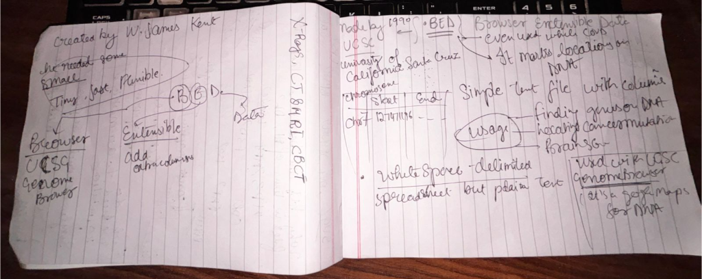

# 📝 Simple Task Manager

<div align="center">



[](https://github.com/Anannya-Vyas/extensions-task-/stargazers)
[](https://github.com/Anannya-Vyas/extensions-task-/network)
[](https://github.com/Anannya-Vyas/extensions-task-/issues)
[](LICENSE) <!-- TODO: Add actual license file -->

**A basic interactive web application for managing tasks, built with vanilla HTML, CSS, and JavaScript.**

[Live Demo](https://anannya-vyas.github.io/extensions-task-/)

</div>

## 📖 Overview

This project is a simple, client-side task manager web application designed to help users organize their daily tasks efficiently. Developed as part of an internship assignment, it demonstrates fundamental web development skills using core web technologies: HTML for structure, CSS for styling, and vanilla JavaScript for interactive functionality. The application allows users to add new tasks, view existing tasks, and manage their completion status directly within the browser.

## ✨ Features

-   🎯 **Task Management**: Add new tasks to a list.
-   📋 **Dynamic Task Display**: View all active tasks in a clear interface.
-   🎨 **Intuitive User Interface**: Clean and simple design for ease of use.
-   ⚡ **Client-side Functionality**: Pure HTML, CSS, and JavaScript implementation, running entirely in the browser.

## 🖥️ Screenshots


## 🛠️ Tech Stack

**Frontend:**


**DevOps:**


## 🚀 Quick Start

This project is a static web application and does not require any build tools or complex setup.

### Prerequisites
-   A modern web browser (e.g., Chrome, Firefox, Edge, Safari).

### Installation

1.  **Clone the repository**
    ```bash
    git clone https://github.com/Anannya-Vyas/extensions-task-.git
    cd extensions-task-
    ```

2.  **Open the application**
    Simply open the `index.html` file in your preferred web browser.
    ```bash
    # Example using a command-line utility (e.g., 'open' on macOS, 'start' on Windows)
    open index.html
    # Or navigate to the file directly through your browser's file menu
    ```

## 📁 Project Structure

```
extensions-task-/
├── index.html      # Main application entry point and HTML structure
├── app.js          # Core JavaScript logic for task management
├── styles.css      # CSS styles for the application's appearance
└── notebook.png    # Screenshot/asset for the README or application
```

## 🔧 Development

### Development Workflow
Development for this project involves directly editing the HTML, CSS, and JavaScript files.
-   Modify `index.html` to adjust the page structure.
-   Update `styles.css` to change the visual styling.
-   Edit `app.js` to enhance or modify the task management functionality.

To see changes, save your files and refresh the `index.html` page in your web browser.

## 🧪 Testing

Testing is performed manually by opening `index.html` in a web browser and interacting with the application's features to ensure they function as expected.

## 🚀 Deployment

This project is designed for static deployment and can be hosted on platforms like GitHub Pages. The live demo is hosted on GitHub Pages, which automatically deploys the `main` branch.

### GitHub Pages Deployment
1.  Push your changes to the `main` branch of your GitHub repository.
2.  Ensure GitHub Pages is enabled for your repository (usually in repository settings).
3.  The application will be accessible at `https://[YOUR_GITHUB_USERNAME].github.io/[REPOSITORY_NAME]/`.

## 🤝 Contributing

We welcome contributions to enhance this project! If you'd like to contribute, please follow these steps:
1.  Fork the repository.
2.  Create a new branch (`git checkout -b feature/your-feature-name`).
3.  Make your changes.
4.  Commit your changes (`git commit -m 'Add new feature'`).
5.  Push to the branch (`git push origin feature/your-feature-name`).
6.  Open a Pull Request.

## 📄 License

This project currently does not have an explicit license file. Please contact the author for licensing information. <!-- TODO: Add an appropriate license like MIT or Apache 2.0 -->

## 🙏 Acknowledgments

-   Built as part of UIET internship work.
-   Deployed using [GitHub Pages](https://pages.github.com/).

## 📞 Support & Contact

-   🐛 Issues: [GitHub Issues](https://github.com/Anannya-Vyas/extensions-task-/issues)

---

<div align="center">

**⭐ Star this repo if you find it helpful!**

Made with ❤️ by [Anannya-Vyas](https://github.com/Anannya-Vyas)

</div>
